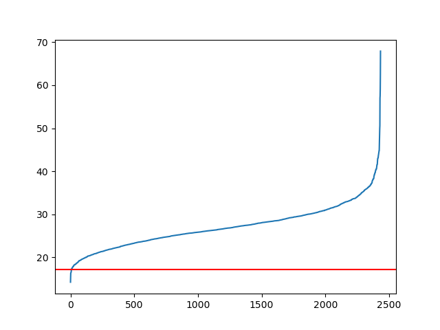

# Exercise 3 - Keyword Spotting

## Packages
- matplotlib 2.0.0
- numpy 1.12.0
- scikit-image 0.13.0
- scipy 0.19.0
- collections
- csv
- future
- multiprocessing
- numbers
- os
- pickle
- PIL
- random
- re
- sys
- timeit

## Data
The data used in this exercise is provided in [this linked git repository](https://github.com/lunactic/PatRec17_KWS_Data). The folders (`ground-truth/`, `images/`, `task/`) have been rearranged so that the project can be downloaded and is ready to go.

The folder `Exercise_3/data/input_documents/images/` contains 15 jpg-images, each represents a page from an ancient (handwritten) document. They are named with their page numbers `270.jpg`, `271.jpg`, ..., `304.jpg`.

The folder `Exercise_3/data/input_documents/` contains a file `transcription.txt` which contains the transcription of all words (on a character level) of the whole dataset. The format is as follows:

	- XXX-YY-ZZ: XXX = Document Number, YY = Line Number, ZZ = Word Number
	- Contains the character-wise transcription of the word (letters seperated with dashes)
	- Special characters denoted with s_
		- numbers (s_x)
		- punctuation (s_pt, s_cm, ...)
		- strong s (s_s)
		- hyphen (s_mi)
		- semicolon (s_sq)
		- apostrophe (s_qt)
		- colon (s_qo)

The folder `Exercise_3/data/input_documents/` also contains another folder, `locations/`, which contains 15 [svg-files](https://de.wikipedia.org/wiki/Scalable_Vector_Graphics), named with their page numbers as well `270.svg`, `271.svg`, ..., `304.svg`. Each of those files contains the bounding boxes for all words on the according document page.

The folder `Exercise_3/data/validation/` contains the file `keywords.txt` which contains a list of keywords, which each occurs at least once in both, the training and the validation dataset.

The subfolder `Exercise_3/data/validation/splits/` contains the files `train.txt` and `valid.txt`, which contain a splitting of the documents pages into a training and a validation set (by stating the page numbers).

The folder `Exercise_3/data/cropped_words/` contains the pre-processed words which are created in the file `Exercise_3/extract_images.py`.

The folder `Exercise_3/data/feature_vectors/` contains the pre-created feature vectors for each image. The feature vectors are created using the sliding window approach. If you want to create the features for each image anew, just delete the content of the folder `Exercise_3/data/feature_vectors/`.

The folder `Exercise_3/data/temp_images/` contains the processed documents. The current set of documents was created using the Sauvola method.

## Description
In this exercise, a machine learning approach for spotting keywords in the provided documents is developed. This approach is tested on the provided training and validation dataset with the provided keywords that can be found at least once in each set for sure.

First, some preprocessing is done. This includes binarization of the data and creation of word images. This is done with the sript `Exercise_3/extract_images.py`. Several binarization approaches have been explored. Besides a trivial quantile cutoff approach, the more sophisticated methods [Otsu](https://en.wikipedia.org/wiki/Otsu's_method) and [Niblack and Sauvola](http://scikit-image.org/docs/dev/auto_examples/segmentation/plot_niblack_sauvola.html) have been used. Comparing the different results, Sauvolas' method is the best. The words contained in the folder `Exercise_3/data/cropped_words` are binarized with this thresholding approach.

Then, the training and validation sets (each is a list of objects of type `Word`) are created with the script `Exercise_3/create_wordlist.py`. The division into training and validation sets is according to the files `train.txt` and `valid.txt` from the folder `Exercise_3/data/validation/splits`. An object of class `Word` contains the following attributes:

- `docNr` : string, the number of the document
- `lineNr` : the number of the line in the document
- `wordNr` : the number of the word in the line
- `img` : the image of the word as numpy array
- `transcript` : the transcription of the word on a character basis as described above
- `featureVector` : the created feature vectors of the word, using sliding window approach

The preprocessed images and the cropped words are then used and analyzed by calculating the featureVectors using the sliding window approach. Done in the script `Exercise_3/FeatureVectorGeneration.py`. To determine the similarity, dynamic time warping was used, done in `Exercise_3/SimilarImages.py` with the help of `Exercise_3/fastdtw.py`.

After calculating the similarity for all words, it has to be decided how many of the most similar words should be returned.

The threshold was determined by using two parameters `limit` and `percentage`.

The plot below shows the similarities for the entire document. It can be noticed that for most queries in the beginning (5-20 most similar words), the similarity rises fast and then it slows down. To set the threshold, the `limit` was set where the graph flattens (takes a curve) (red line). To fine-tune the threshold based on the data, the `percentage` parameter was used. It modifies the limit as follows: `x+(limit-x)*percentage`, where `x` is the smallest similarity of all words.

A set of test runs has been done to fine-tune the `percentage` parameter. Therefore, it was looked for the `keywords.txt` images inside the train set.

The results of the runs can be found [here](parameter%20selection).

It was decided to pick a percentage of 0.9, because the precision is close to the one from lower percentages, but the recall is in a better spot.

## Instructions
1. If the experiment should be reproduced, the git repo can just be cloned and the working directory should be set to `Exercise_3/`. If the feature vector generation should be reproduced, the content of the folder `Exercise_3/data/feature_vectors/` has to be cleared.
2. The variable `test` in `Evaluation.py` can be adjusted to the number of images that should be tested.
3. Finally, `Exercise_3/Evaluation.py` should be run.

## Results
Because there is no possibility to access a high performant clusters, the amount of test files used for the results had to be limited. To do so, 50 images were picked at random from the test set. The average precision was 18% and the recall was 7%.

## Conclusion
Even with the optimal parameters, the performance was very bad :-(.
